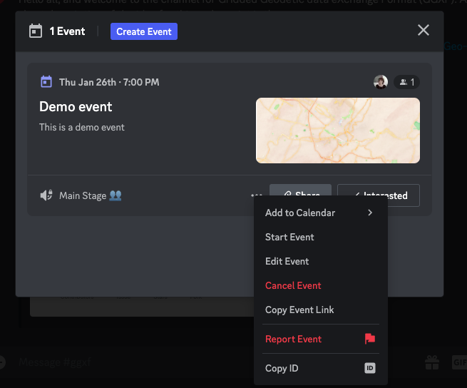
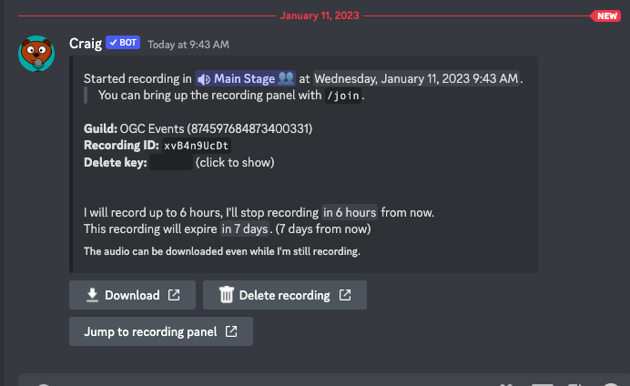

# During the code sprint

#### Starting Events

When the time of the event comes, start it, by clicking on the event and bringing the three-dots menu, next to the share button. Once you start the event, it will be announced in the server.

&#x20;

You can end the event, by leaving the channel where the event os taking place.

#### Recording Audio

It is possible to record audio of the discord meetings, using the [craig bot](https://craig.chat/), installed on the server.

In order to record, go to one of the text channels under the `staff` section and type:

`/join channel:Main Stage 👥` (replace Main Stage 👥, by the name of the channel you want to record.

There will be an acknowledgement message on the channel, which includes a `stop` button. Do not forget to stop the recording, either by clicking the `stop` button, or by typing:

`/leave channel:Main Stage 👥`

Once you start recording, the craig bot will send you a private message which contains a link to download the recording. The link will expire within 7 days.

If you click the download link, it will take you to a an external webpage to download the recording. I find it that this operation works best on Safari. Choose the single track mixing in AAC format and wait for it to process the track (this may take a while, an it is quite intensive on the CPU).

When the track is ready, you can download it and put it somewhere accessible (e.g.: OGC portal).

&#x20;
