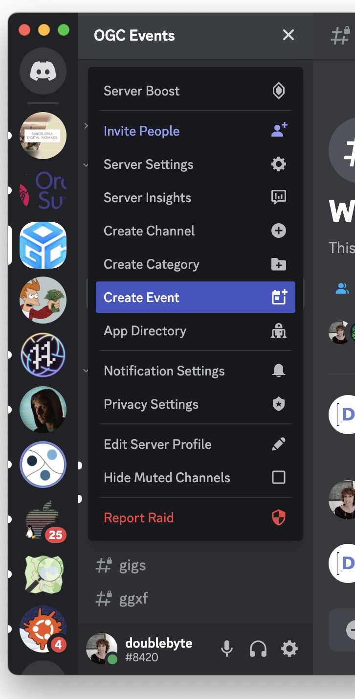
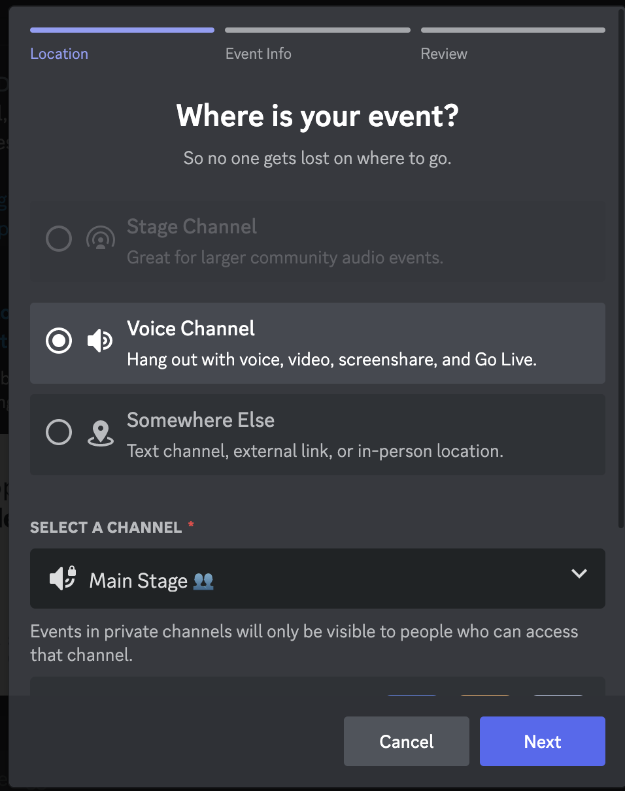
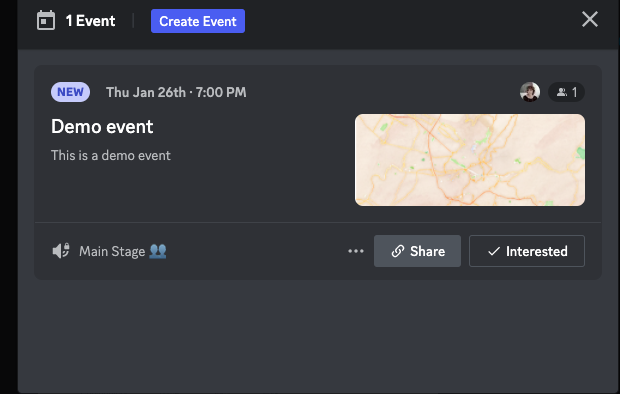

# Initial Setup

### Adding Channels

Each focused code sprint, features channels for each specification.

If these channels do not exist for the current code sprint, you should create them before hand. You can do that by clicking on the `+` channel next to the `general` section (on the left panel). Type the name of the channel, following the format `ogc-api-somename`, in the case of ogc apis, and use the default settings.

After creating the channel, you should [bridge it to matrix](https://matrix.org/bridges/), so that users can use any client they like to access the text channels. In order to create a discord bridge on matrix, you will also need to be an admin on #ogc:matrix.org.&#x20;

### Creating a Discord-Matrix Bridge

Use a client to access #ogc:matrix.org (for instance, [element](https://app.element.io/#/room/#ogc:matrix.org)) and follow these steps to enable the bridge:

1. Create a public room
2. Invite the Discord bridge bot to join this room and wait for it to join the room.
3. Type in the matrix room: `!discord bridge ServerID ChannelID`. If you don't know the server and channel id, access discord through the web interface - you will find them on the url of the channel. For instance: [https://discord.com/channels/874597684873400331/1062426690401353798](https://discord.com/channels/874597684873400331/1062426690401353798)
4. The Discord bridge bot should reply: "I'm asking permission from the guild administrators to make this bridge.". Go to the discord channel you want to bridge and type:`!matrix approve` within the next 5 minutes.

After completing the bridge, everything you type on the matrix room will be broadcasted to discord, and vice versa.

### Adding Events

Discord supports adding events, which can be started at the scheduled date/time.  Once an event starts, users will see a pop-upon the screen and once they click it, they will be taken to the relevant channel. This is useful, because it will keep users updated to what is happening on the server, and reduce the likelihood that they will miss schedule events.&#x20;

To create an event, bring up the context menu at the server name, and choose `Create event`.

Then follow along, filling the options. Events normally take place at the #Main Stage voice channel, except for the tutorials which normally take place at the #Mentor Room. Occasionally, smaller events can take place at the #Breakout Room. If you are adding an event which will take place outside discord (e.g.: GoToMeet), you should choose the "Somewhere else" option, and later add the link for the meeting.

Once the event is created, it will create an hyperlink which you can use to share the event through social media, or even within discord.

At any moment, anyone can check out the list of scheduled events in the channel, by clicking on `Events`, at the upper right corner of the side panel.
