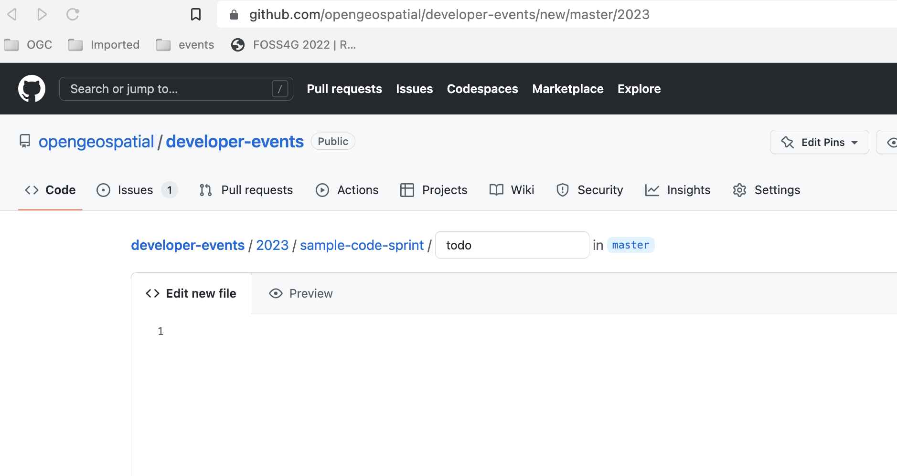

# Adding a folder

In the [GitHub repository](https://github.com/opengeospatial/developer-events), navigate to the folder of the year you want to create the sprint (e.g.: `2023`). Than press `Add File`-> `Create new file`, and type the name of the folder (which should match the name of the wiki page; e.: `Web-Mapping-Code-Sprint`), followed by `\`. GitHub does not allow creating a folder with nothing in it, so add the name of a file at the end (e.g.: `TODO`) to create an empty file, and commit the changes.

You can use this folder to upload relevant files through the UI, before and during the code sprint (`Add File`-> `Upload files`).
