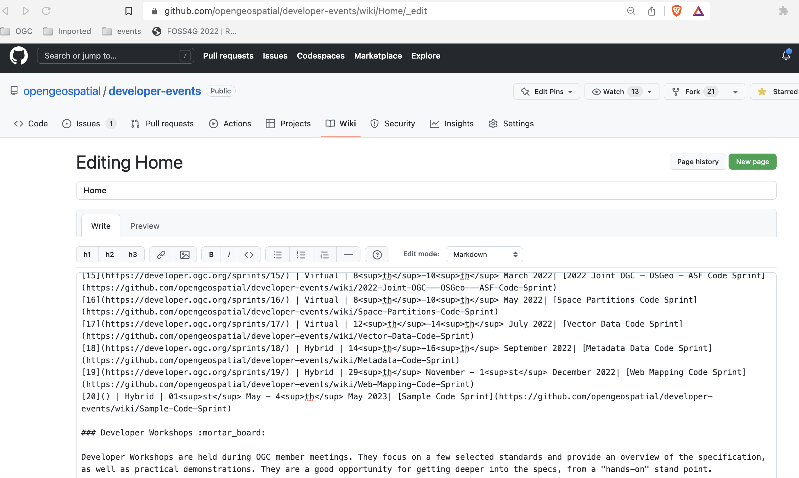
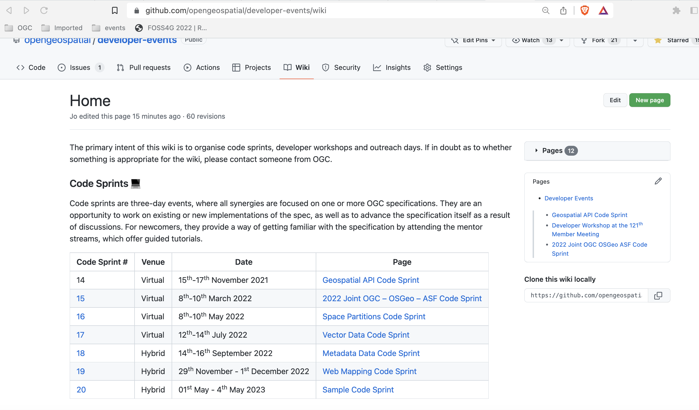
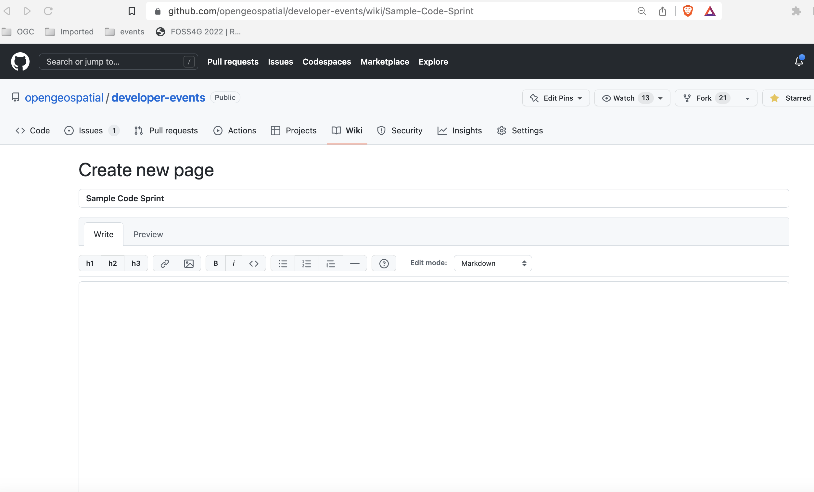

# Adding a new wiki page

You can start by adding a menu entry for the code sprint at the [wiki home page](https://github.com/opengeospatial/developer-events/wiki), by clicking on the `edit` button. If you want, copy the information from the previous row and customize it. The first column is the number of the code sprint: you can increase one number from the previous enrty. This type of code sprints do not have a website, so you can leave the link empty.&#x20;

The last column is the link to the wiki page. Choose a name that matches the name of the code sprint, with spaces replaced by `-`; for instance: [https://github.com/opengeospatial/developer-events/wiki/Sample-Code-Sprint](https://github.com/opengeospatial/developer-events/wiki/Sample-Code-Sprint)

You can save by scrolling down and clicking the `Save page button`. You should see the new entry appear.

If you click on the link over the name of the sprint, it will prompt you to create a new page. If you want, edit one of the previous pages before hand and edit the content. Then copy it to the clipboard and paste it, once you create the new page. You can use it as a starting point, removing the parts you don't need.

At the bare minimum, you will need this information for creating the wiki page:

* Title and topics of the code sprint.
* Date and Location (if hybrid).

Knowing the dates, it is possible to work out, at least a provisional agenda.&#x20;

If/when you have sponsor/host information and any tutorials to present in the mentor stream, you can also add that information.

