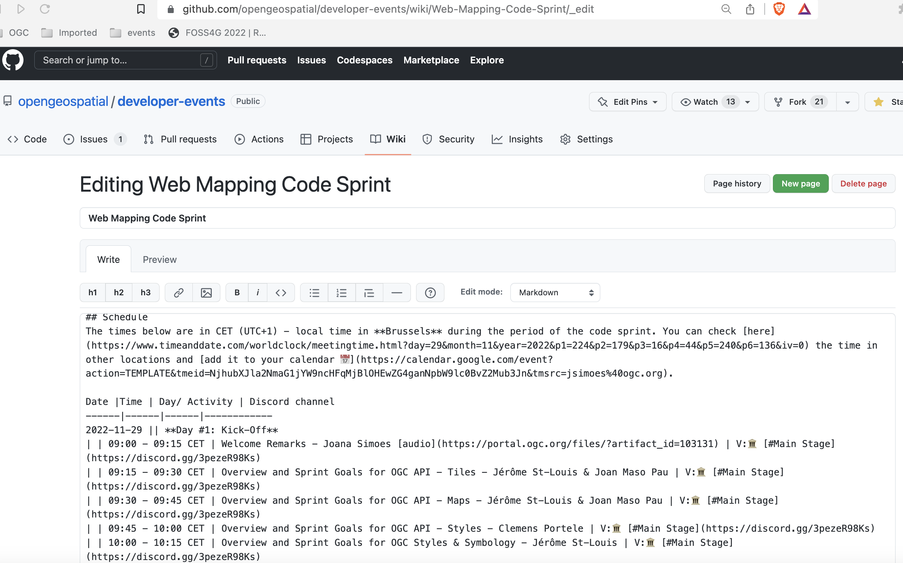

# Maintaining the wiki page

During the code sprint you can update the wiki page as needed, with last minutes changes. For instance, you can add any ad-hoc meetings to the agenda, or proposed tutorials for the mentor stream. You can also encourage the participants to update the page themselves, for instance if they want to add any items to the agenda.

During, or after the event, you should update the agenda with hyperlinks for the recordings of the sessions.

